# NGINX Experience - Workshop Guide

## Module 2 - Configure Web server

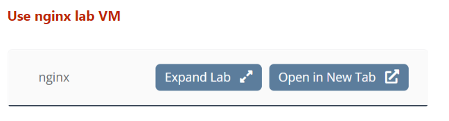

**Remove the existing default server**

`cd /etc/nginx/conf.d`

`sudo mv default.conf default.conf.bak`

`sudo nginx -s reload`

**Create web server configuration**

`cd /opt/services/ `

`cd App1/`

`ls`

`cat index.html`

`cd /etc/nginx/conf.d/`

`sudo vim web.conf`

```
server {  
  listen 9001;
  index index.html;

  location / {
    root /opt/services/App1;
  }
}


server {
  listen 9002;
  index index.html;

  location / {
    root /opt/services/App2;
  }
}

server {
  listen 9003;
  index index.html;

  location / {
    root /opt/services/App3;
  }
}
```

**Access the web servers**

`curl localhost:9001`

`curl localhost:9002`

`curl localhost:9003`


Open Firefox browser and visit the following URLs
* nginx.local:9001
* nginx.local:9002
* nginx.local:9003

You should see the following results

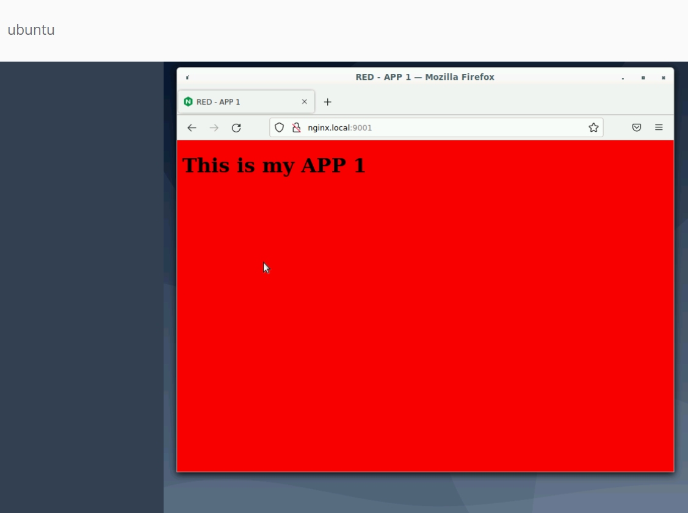

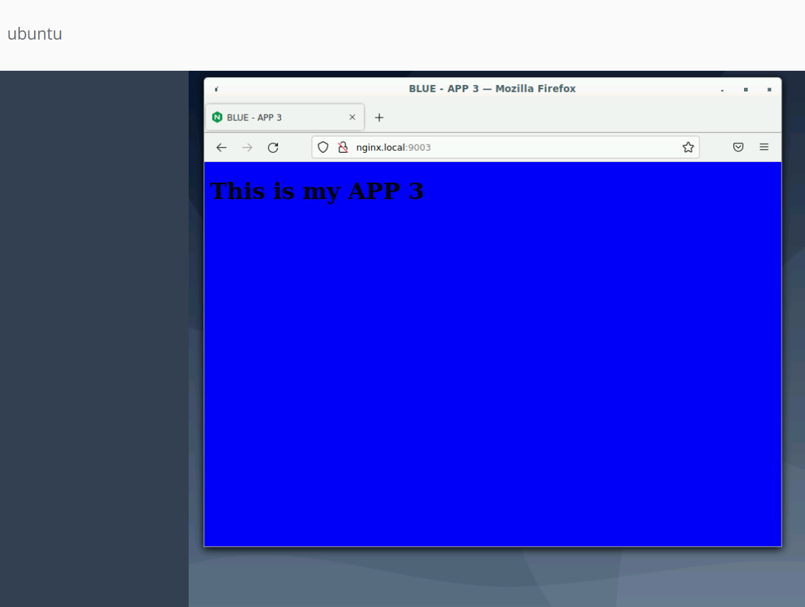


<br/>
<br/>


## Module 3 - Configuring Load Balancing and NGINX+ Dashboard


**Configure Load Balancer**

`cd /etc/nginx/conf.d`

`sudo vim lb.conf`

```
upstream backend_servers {
  zone backend_server_zone 64k;
  server 127.0.0.1:9001;
  server 127.0.0.1:9002;
}

server {
  listen 9000;
  autoindex on;

  location / {
    proxy_pass http://backend_servers/;

    proxy_set_header Host $host;
    proxy_set_header X-Forwarded-For $proxy_add_x_forwarded_for;
    proxy_set_header X-Real-IP $remote_addr;
    proxy_set_header Upgrade $http_upgrade;
    proxy_set_header Connection "upgrade";
  }
}
```

`sudo nginx -s reload`

`curl localhost:9000`

Repeat multiple times. What can you observe?


**Configuring NGINX Plus Dashboard**

`sudo vim /etc/nginx/conf.d/dashboard.conf`

```
server {
  listen 8080;
  location /api {
    api write=on;
  }

  location / {
    root /usr/share/nginx/html;
    index dashboard.html;
  }
}
```

**Access The NGINX+ dashboard**

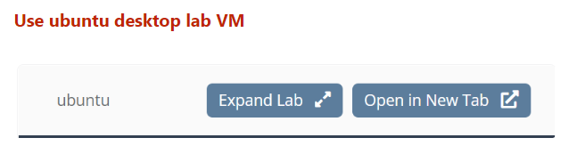

Open browser and visit http://nginx.local:8080. You should see the NGINX+ Dashboard  

**Add a Dynamic Server**
* Go to N+ Dashboard. Click on HTTP Upstreams.
* Click on ‘edit’ icon next to backend_servers.
* Click Add server.
* Add 127.0.0.1:9003.
* Set state as “up”
* Click “Add”

**NOTE:** App3 Server will disappear on NGINX restart as we have not created a “state”
file for NGINX to store this dynamically added information

**SELF Exercise:**

Edit the /etc/nginx/conf.d/lb.conf file and add the server 127.0.0.1:9003


## Module 4 - API Gateway

**Enabling the API**


`cd ~/NJS-ErgastF1API`

Start the API Docker containers

`sudo docker compose up -d`

Check the API containers are running

```
orasilabs@ip-172-31-30-69:/opt/NJS-ErgastF1API$ sudo docker container ls
CONTAINER ID   IMAGE                          COMMAND                  CREATED              STATUS              PORTS                             
                     NAMES
1d7295f0ce53   phpmyadmin/phpmyadmin:5.0.4    "/docker-entrypoint.…"   About a minute ago   Up About a minute   0.0.0.0:5000->80/tcp, :::5000->80/
tcp                  phpmyadmin
0f391a309463   njs-ergastf1api-api-server     "docker-entrypoint.s…"   About a minute ago   Up About a minute   0.0.0.0:8080->8732/tcp, :::8080->8
732/tcp              api-server
431ea6a152b0   njs-ergastf1api-mysql-server   "docker-entrypoint.s…"   About a minute ago   Up About a minute   0.0.0.0:3306->3306/tcp, :::3306->3
306/tcp, 33060/tcp   mysql-server
```

Test an API request

`curl localhost:8080/drivers | jq`


**Configuring NGINX as an API Gateway**


`sudo vim /etc/nginx/conf.d/api_gateway.conf`

```
upstream f1-api {
  # replace the IP address with your own.
  # Find the IP address of your api-backend VM
  server 172.31.30.69:8080;
}

server {
  listen 9443;

  location /api/f1/drivers {
      proxy_pass http://f1-api/drivers;
  }

  location /api/f1/seasons {
      proxy_pass http://f1-api/seasons;
  }

  location /api/f1/circuits {
      proxy_pass http://f1-api/circuits;
  }
}
```

`sudo nginx -s reload`

`curl localhost:9443/api/f1/drivers | jq`

`curl localhost:9443/api/f1/seasons | jq`

`curl localhost:9443/api/f1/circuits | jq`


**Sending API Requests from Postman**


Open Postman and use it to send the following API requests. Observe the response bodies

* http://nginx.local:9443/api/f1/drivers
* http://nginx.local:9443/api/f1/seasons
* http://nginx.local:9443/api/f1/circuits


<br/>

**Adding SSL Termination**


`sudo mkdir -p /etc/nginx/ssl`

`cd /etc/nginx/ssl`

`sudo cp ~/www.example.com* .`

`sudo vim /etc/nginx/conf.d/api_gateway.conf`

Add the following lines into the server {} block

```
ssl_certificate /etc/nginx/ssl/www.example.com.crt;
ssl_certificate_key /etc/nginx/ssl/www.example.com.key;
ssl_protocols TLSv1.3 TLSv1.2;
ssl_prefer_server_ciphers on;
```

Change the `listen` directive to the following:

`listen 9443 ssl;`

Save the config and reload nginx

`sudo nginx -s reload`


Open Postman and use it to send the following API requests. Observe the response bodies

Disable the SSL verification when prompted since we are using an untrusted certificate

* https://nginx.local:9443/api/f1/drivers
* https://nginx.local:9443/api/f1/seasons
* https://nginx.local:9443/api/f1/circuits


### Enabling API Authentication with JWTs


**Step 1**

Use base64 to create a JSON Web Key (symmetric key used for signing or a
secret) using the secret “mysecretpassword”. The tr command makes the required
character substitutions for Base64URL encoding.

`echo -n mysecretpassword | base64 | tr '+/' '-_' | tr -d '='`

The output should be the following string

`bXlzZWNyZXRwYXNzd29yZA`

**Step 2**

Create the file api_secret.jwk with the JSON Web Key to be used for signing.

`sudo vim /etc/nginx/api_secret.jwk`

```
{"keys":
    [{
        "k":"bXlzZWNyZXRwYXNzd29yZA",
        "kty":"oct"
    }]
}
```

**Step 3**

`sudo vim /etc/nginx/conf.d/api_gateway.conf`

Add the following directives to the server block in the api_gateway.conf file

```
auth_jwt "F1 API";
auth_jwt_key_file /etc/nginx/api_secret.jwk;
```

Your `api_gateway.conf` file should look like this:

```
upstream f1-api {
  server 172.31.30.69:8080;
}

server {
  listen 9443 ssl;

  ssl_certificate /etc/nginx/ssl/www.example.com.crt;
  ssl_certificate_key /etc/nginx/ssl/www.example.com.key;
  ssl_protocols TLSv1.3 TLSv1.2 TLSv1.1;
  ssl_prefer_server_ciphers on;

  auth_jwt "F1 API";
  auth_jwt_key_file /etc/nginx/api_secret.jwk;

  location /api/f1/drivers {
    proxy_pass http://f1-api/drivers;
  }

  location /api/f1/seasons {
    proxy_pass http://f1-api/seasons;
  }

  location /api/f1/circuits {
    proxy_pass http://f1-api/circuits;
  }
}
```

**Step 4**

`sudo nginx -s reload`

**Step 5**

Open your web browser and go to https://jwt.io/

On the **Decoded** right side of the screen, enter the following data as shown on the image.

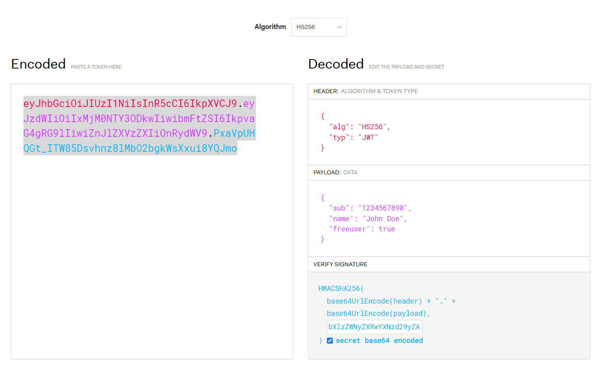

On the **Verify Signature** section, notice that we use the JSON web key we generated in **Step 1**

Also, make sure to tick the **secret base64 encoded** checkbox.


**Step 5**


Open Postman and send the following API requests

`https://nginx.local:9443/api/f1/drivers`

You will notice a 401 Authorization Required response because we did not specify our API key in the request.

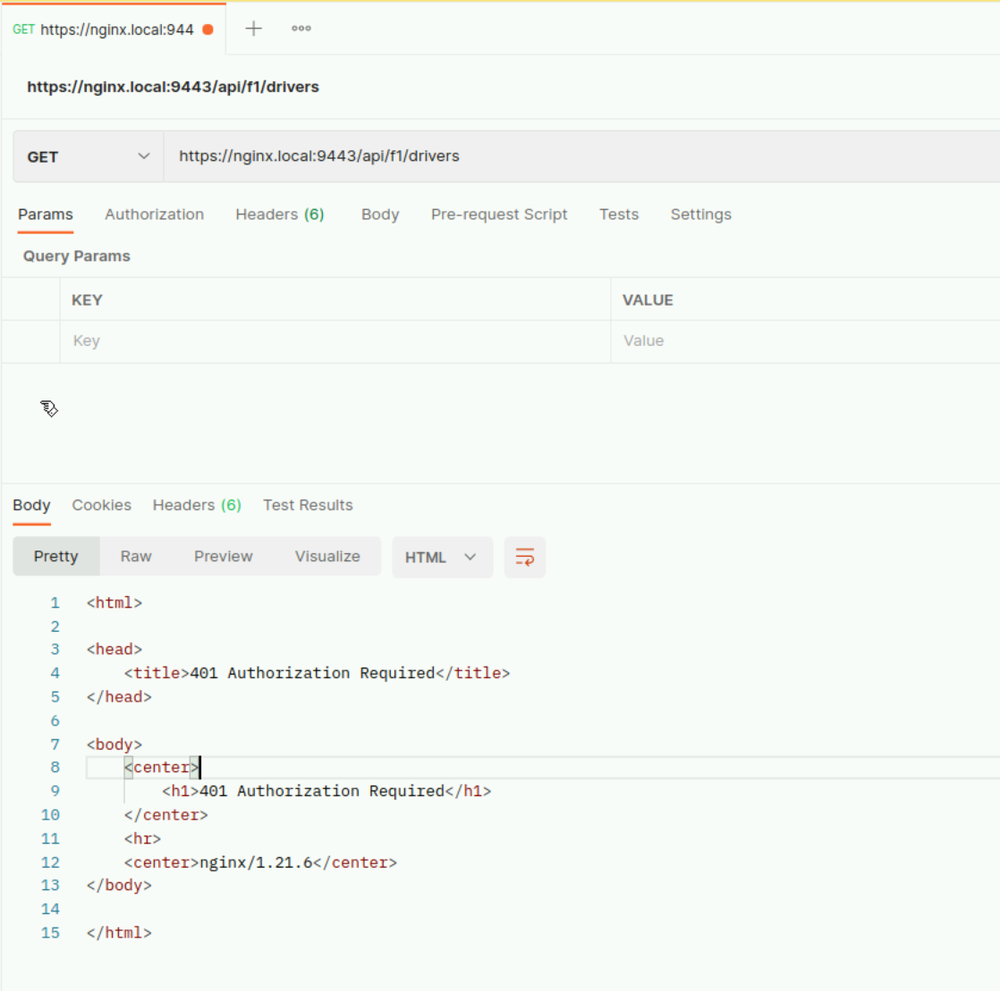


**Step 6**

Edit the Postman request by clicking on the `Authorization` tab. Select `Bearer Token` from the dropdown list and input the JWT token that was generated from https://jwt.io/

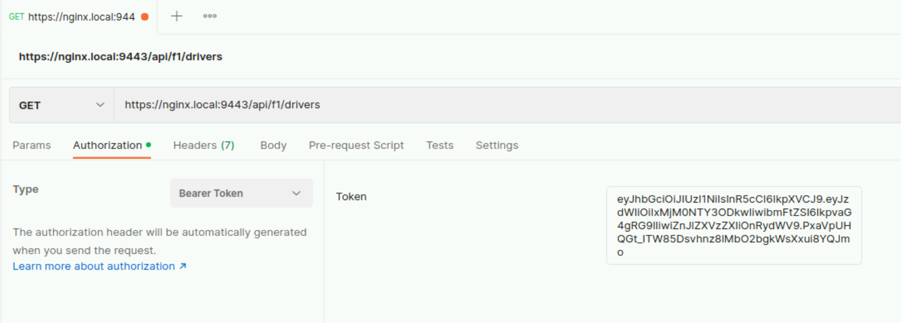

**Step 7**

Send the request. You should see the actual results this time.


## Configuring fine grained API Authorization using JWTs

Let's pretend our API has free users and paid users. We want to block free users from accessing the F1 Seasons API to encourage people to sign and pay. We can use JWT claims to identify if a user is on the free tier. Our JWT token body consists of the following

```
{
  "sub": "1234567890",
  "name": "John Doe",
  "freeuser": true
}
```

Each key / value pair is considered a `JWT claim` by NGINX and can be accessed by using the variable `$jwt_claim_<key>`.

For example the variable `$jwt_claim_freeuser` would return the value of the `freeuser` key in the token body.

**Step 1**


`sudo vim /etc/nginx/conf.d/api_gateway.conf`

Modify your `api_gateway.conf` file and add the `if` block as shown below:

```
location /api/f1/seasons {

  if ($jwt_claim_freeuser = "true") {
    return 403;
  }

  proxy_pass http://f1-api/seasons;
}
```

**Step 2**

`sudo nginx -s reload`

**Step 3**


Use Postman to send a request to https://nginx.local:9443/api/f1/seasons

Remember to configure the Bearer Token and specify your JWT Token.

What is the result you  get?

Why did we get this result?


## Module 5 - Rate Limiting, Caching and Active Health Checks

### Enable Rate Limiting


**Step 1**

`sudo vim /etc/nginx/conf.d/api_gateway.conf`


**Step 2**

For simplicity, we will disable the JWT Authentication from the configuration.
Comment out all the JWT related directives and delete the `if` block

**Step 3**

Add the following directive on the first line of the configuration

`limit_req_zone $remote_addr zone=perip:1m rate=2r/s;`

**Step 4**

Add the following directives into the `server` block

```
limit_req zone=perip nodelay;
limit_req_status 429;                 
```

**Step 5**

`sudo nginx -s reload`

**Step 6**

`curl -k https://localhost:9443/api/f1/drivers`

**Step 7**

Run `!!;!!;!!;!!;!!;`

What do you notice in the output?  


### Enabling Caching

**Step 1**

Edit the `lb.conf` file

`sudo vim /etc/nginx/conf.d/lb.conf`


**Step 2**

Add the following line at the top

`proxy_cache_path /data/nginx/cache levels=1:2 keys_zone=upstream_cache:20m inactive=5m max_size=2G;`

**Step 3**

Add the follow directives in the location block

```
proxy_cache upstream_cache;
proxy_cache_key $scheme$host$request_uri;
proxy_cache_valid 5m;
add_header X-Cache-Status $upstream_cache_status;
```

**Step 4**

`sudo nginx -s reload`

**Step 5**

Run `curl -i localhost:9000` twice.

**What do you notice in the response?**


**Step 6**


Open the browser and go to the NGINX+ Dashboard page at `http://nginx.local:8080`.

You should see a Cache tab with your cache details


### Active Health Checks


`sudo vim /etc/nginx/conf.d/lb.conf`

Add the `health_check` directive into the `location /` block

```
server {
    listen 9000 default_server;

    location / {
        proxy_pass http://backend_servers/;
        health_check;
        ….
    }
}
```

`sudo nginx -s reload`


Open the NGINX+ Dashboard and check your **HTTP Upstreams** tab. You should see the health checks count against the upstream servers of the **backend_servers** upstream

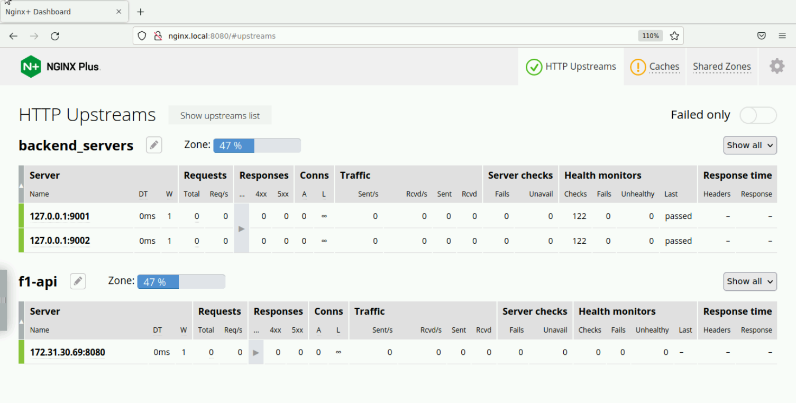


### Using the Key Value Store to setup a Deny list


**Step 1**

`sudo vim /etc/nginx/conf.d/lb.conf`

**Step 2**

Add the following directives above the `server ()` block

```
keyval_zone zone=allowlist_zone:1m type=ip state=allowlist_zone.keyval;
keyval $remote_addr $target zone=allowlist_zone;
```

**Step 3**

Add the following `if` block into the `server` block

```
if ($target) {
    return 403;
}
```

**Step 4**

`sudo nginx -s reload`

**Step 5**

Find the IP address of your **ubuntu lab VM**

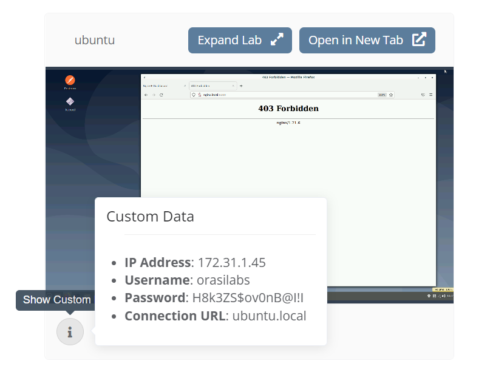

**Step 6**

Using the IP address from Step 5, run

`curl -X POST -d '{"172.31.1.45":"1"}' -s 'http://localhost:8080/api/7/http/keyvals/allowlist_zone'`

**Step 7**

Check the key value Store. You should see the IP address you just added, with a target value of 1

```
curl -X GET http://localhost:8080/api/7/http/keyvals/allowlist_zone
{"172.31.1.45":"1"}
```

**Step 8**

`curl localhost:9000`

Notice how this is allowed.

**Step 9**


Open the browser and hit the URL `nginx.local:9000`

Notice the 403 Forbidden response. This is because the VM's IP address has been blocked in our key value store. We set the $target value to '1'

**Step 10**


Replace the IP address in the example with your ubuntu Lab IP

`curl -X PATCH -d '{"172.31.1.45":"0"}' -s 'http://localhost:8080/api/7/http/keyvals/allowlist_zone'`

**Step 11**

Repeat Step 9. You should now be able to hit nginx.local:9000


## Module 6 - NGINX App Protect

**Step 1**

`sudo vim /etc/nginx/nginx.conf`

Add the following directive at the top of the configuration file

`load_module modules/ngx_http_app_protect_module.so;`

**Step 2**

Restart nginx

`sudo nginx -s stop`

`sudo nginx`

**Step 3**

`sudo vim /etc/nginx/conf.d/lb.conf`

Add the following directives into the `server {} block`

```
app_protect_enable on;
app_protect_policy_file "/etc/app_protect/conf/NginxDefaultPolicy.json";
app_protect_security_log_enable on;
app_protect_security_log "/opt/app_protect/share/defaults/log_illegal.json" /var/log/app_protect/security.log;
```

**Step 4**

`sudo nginx -s reload`

**Step 5**

`curl localhost:9000`

The request succeeds as normal

**Step 6**

`curl 'localhost:9000/?<script>''`

The request is blocked since the `/?<script>` URI matches with signatures in App protect which suggest that the request is an XSS attack.


```
orasilabs@ip-172-31-30-52:~$ curl 'localhost:9000/?<script>'
<html><head><title>Request Rejected</title></head><body>The requested URL was rejected. Please consult with your administrator.<br><br>Your suppor
t ID is: 1805232973648242475<br><br><a href='javascript:history.back();'>[Go Back]</a></body></html>
```

**Step 7**

Examine the security log

`cd /var/log/app_protect`

`tail -f security.log`


## Module 7 - Intro to Kubernetes


### Start your Kubernetes cluster

For all our Kubernetes exercise we will use minikube. Minikube quickly sets up a local Kubernetes cluster and can run on Linux, MacOS and Windows. Minikube is ideal for developers who need to build and deploy apps in their local environment. It is not intended for production use. For more information on minikube see https://minikube.sigs.k8s.io/docs/

**Step 1**

Open a terminal in your Ubuntu lab VM. Minikube has already been installed and all we need to do is start the cluster.

Run `minikube start`

```
orasilabs@ip-172-31-9-247:~/Desktop$ minikube start
  minikube v1.27.1 on Ubuntu 20.04
✨  Using the docker driver based on existing profile
  Starting control plane node minikube in cluster minikube
  Pulling base image ...
  Restarting existing docker container for "minikube" ...
  Preparing Kubernetes v1.25.2 on Docker 20.10.18 ...
  Verifying Kubernetes components...
    ▪ Using image docker.io/kubernetesui/dashboard:v2.7.0
    ▪ Using image gcr.io/k8s-minikube/storage-provisioner:v5
    ▪ Using image docker.io/kubernetesui/metrics-scraper:v1.0.8
  Enabled addons: storage-provisioner, default-storageclass, dashboard
  Done! kubectl is now configured to use "minikube" cluster and "default" namespace by default

```


**Step 2**

Check your cluster nodes

```
orasilabs@ip-172-31-9-247:~/Desktop$ kubectl get nodes
NAME       STATUS   ROLES           AGE   VERSION
minikube   Ready    control-plane   20d   v1.25.2
```


### Deploy Apps in Kubernetes

We will deploy a few sample applications in Kubernetes and expose them using a Service

**Step 1**

Deploy NodeApp1. This is simple NodeJS app that prints a hello world message.

`cd ~/nginx-demo-apps/nodeapp1`

`kubectl apply -f deployment.yaml`

```
orasilabs@ip-172-31-9-247:~/nginx-demo-apps/nodeapp1$ kubectl apply -f deployment.yaml
deployment.apps/application1 created
```

**Step 2**

We now expose NodeApp1 for external access by using a NodePort Service.

`kubectl apply -f service.yaml`

```
orasilabs@ip-172-31-9-247:~/nginx-demo-apps/nodeapp1$ kubectl apply -f service.yaml
service/application1-service created
```

**Step 3**

We repeat the process for NodeApp2, which is the same application but it simply prints a different message.

`cd ~/nginx-demo-apps/nodeapp2`

`kubectl apply -f deployment.yaml`

`kubectl apply -f service.yaml`

**Step 4**

Check your Pods, Deployments and Services.

```
orasilabs@ip-172-31-9-247:~/nginx-demo-apps/nodeapp2$ kubectl get pods
NAME                            READY   STATUS    RESTARTS   AGE
application1-86c6c44bdf-dscs5   1/1     Running   0          4m43s
application1-86c6c44bdf-jsd4j   1/1     Running   0          4m43s
application2-86584dd9cb-mjr9f   1/1     Running   0          10s
orasilabs@ip-172-31-9-247:~/nginx-demo-apps/nodeapp2$
orasilabs@ip-172-31-9-247:~/nginx-demo-apps/nodeapp2$ kubectl get deployments
NAME           READY   UP-TO-DATE   AVAILABLE   AGE
application1   2/2     2            2           4m58s
application2   1/1     1            1           25s
orasilabs@ip-172-31-9-247:~/nginx-demo-apps/nodeapp2$
orasilabs@ip-172-31-9-247:~/nginx-demo-apps/nodeapp2$ kubectl get services
NAME                   TYPE        CLUSTER-IP       EXTERNAL-IP   PORT(S)          AGE
application1-service   NodePort    10.103.149.240   <none>        3000:30163/TCP   3m4s
application2-service   NodePort    10.102.21.33     <none>        3000:30164/TCP   33s
kubernetes             ClusterIP   10.96.0.1        <none>        443/TCP          20d
```

**Step 5**

Access the Kubernetes Dashboard. We can get the same information we saw from the CLI, on the built in Kubernetes dashboard.

Open a new terminal and run `minikube dashboard`

Minikube will automatically open your browser and load the dashboard page.

**Step 6**

View our Services. Click on the **Services** link on the left navigation. You should be able to see the `application1-service` and `application2-service`

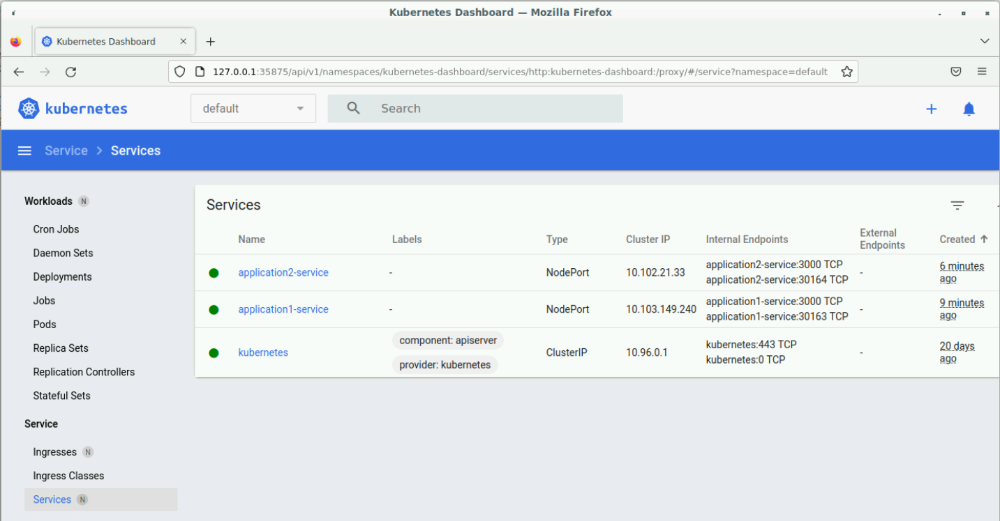


**Step 7**

Now let's access our applications. Because we used a NodePort service, we can access our application by using the IP address of any Node in our Kubernetes cluster and the port the service is assigned to.
With minikube, there is only one Node in the cluster and we can get the node IP by running `minikube ip`

```
orasilabs@ip-172-31-9-247:~/nginx-demo-apps/nodeapp2$ minikube ip
192.168.49.2
```

From the Dashboard we can see that application1-service is exposed on port 30163.

Open a new browser tab and go to 192.168.49.2:30163. You should see the following:

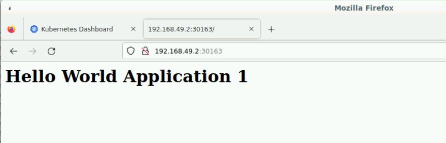


**Step 8**

Access Nodeapp2 on your browser? Can you work out the steps on your own?


## Module 8 - NGINX Kubernetes Ingress Controller

### Install the NGINX Ingress Controller

We will install the NGINX Ingress Controller using the manifest method.

**Step 1**
Look at the install script. All of the necessary commands are here.

`cd ~/`

`cat setup-nginx-ingress.sh`

**Step 2**

Run the install script.

`./setup-nginx-ingress.sh`

**Step 3**

Find you NGINX Ingress Controller pod.

`kubectl get pods -n nginx-ingress`

The `-n` parameter specifies the Kubernetes namespace we want to look at. By default, the NGINX IC Pod is deployed in the `nginx-ingress` namespace.

```
orasilabs@ip-172-31-9-247:~$ kubectl get pods -n nginx-ingress
NAME                             READY   STATUS    RESTARTS   AGE
nginx-ingress-5f447dbdb5-rdpw6   1/1     Running   0          19m
```

**Step 4**

Expose the IC Pod to external access.

We have deployed the IC Pod using a Deployment resource. Now we need to expose it using a Service, similar to how we exposed our NodeApp1 and NodeApp2 previously.

`cd ~/kubernetes-ingress/deployments/service/`

Notice the `nodeport.yaml` file in the folder.

Run `kubectl apply -f nodeport.yaml`

```
orasilabs@ip-172-31-9-247:~/kubernetes-ingress/deployments/service$ kubectl apply -f nodeport.yaml
service/nginx-ingress created
```

**Step 6**

Get the NGINX Ingress Service details

`kubectl get service -n nginx-ingress`

```
orasilabs@ip-172-31-9-247:~/kubernetes-ingress/deployments/service$ kubectl get service -n nginx-ingress
NAME            TYPE       CLUSTER-IP     EXTERNAL-IP   PORT(S)                      AGE
nginx-ingress   NodePort   10.107.64.43   <none>        80:30067/TCP,443:30936/TCP   52s
```

Take note of the port numbers assigned to the Service. In this example, port 30067 maps to port 80 in the Pod. Port 30936 maps to port 443. Your assigned ports may be different.

**Take note of these port numbers and remember them. You will need them in future exercises**

**Note:** Using a NodePort service to expose the NGINX IC Pod is not recommended for production due to the port number being in the range of 30000 and 32767. A LoadBalancer service is usually the recommended option for production deployments.


**Step 7**

Open a new browser tab and hit your NGINX instance by using the URL `http://<minikube ip>:<nodeport>`

Remember how to find your minikube IP?

You will receive a 404 Not Found response. This is because, currently NGINX does not have any servers configured for it to route requests to.


## Module 10 - Configuring VirtualServer Resources

### Exercise 1 - Configuring a VirtualServer

Previously, we deployed two simple NodeJS apps and exposed them through a NodePort service. We have since deployed NGINX as an Ingress Controller in our cluster. Now we want to configure a VirtualServer resource so we can expose our Apps via NGINX.

**Step 1**

`cd ~/nginx-demo-apps`

`cat application-virtualServer.yaml`

```
orasilabs@ip-172-31-8-165:~/nginx-demo-apps$ cat application-virtualserver.yaml
apiVersion: k8s.nginx.org/v1
kind: VirtualServer
metadata:
  name: apps
spec:
  host: example.com
  upstreams:
  - name: application1
    service: application1-service
    port: 3000
  - name: application2
    service: application2-service
    port: 3000
  routes:
  - path: /app1
    action:
      pass: application1
  - path: /app2
    action:
      pass: application2
```

**Step 2**

Configure the VirtualServer

`kubectl apply -f application-virtualserver.yaml`

**Step 3**

View the VirtualServers configured for the cluster

```
orasilabs@ip-172-31-8-165:~/nginx-demo-apps$ kubectl get virtualserver
NAME   STATE   HOST          IP    PORTS   AGE
apps   Valid   example.com                 45m
```

**Step 4**

Our application needs to be accessed via the hostname `example.com`. In a production deployment, you would configure DNS entries to point the hostname to external IP of the service that exposes the NGINX IC Pod. However for our minikube setup, we will simply add an entry in the `/etc/hosts` file.

`sudo vim /etc/hosts`

Add the following entry

`192.168.49.2 example.com`

The IP address `192.168.49.2` is the address of our cluster node.

**Step 5**

 Open a new browser tab and hit the URL `example.com:<nodeport>/app1`

 Your <nordport> can be found by running `kubectl get services -n nginx-ingress`

 Now try the URL `example.com:<nodeport>/app2`


## Deploy the Arcadia App

### Part 1 - VirtualServer

Now that we have an understanding on how to deploy apps in Kubernetes and how to configure a VirtualServer resource to expose those apps, let's deploy a more production ready example application.

For this workshop we are going to use the “Arcadia Crypto” application. The application is built with 6 different microservices that are deployed in the Kubernetes environment.

By the end of the workshop the “Arcadia Crypto” will be fully deployed and protected

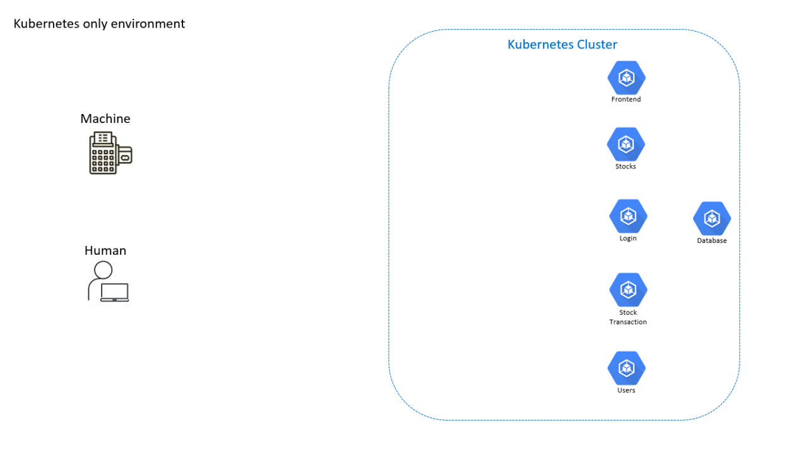

We will deploy our application in the Kubernetes environment.
As stated before, these are the 6 microservices which we will deploy.
* Frontend - serves the non-dynamic content for like html, js, css and images
* Login - in in charge of dealing with anything related to the login user functionality
* Users - all user data interaction is done through this microservice only
* Stocks - connects to external resources to get the latest crypto data and serves it to the
application clients
* Stocks Transaction - Deal with all related to buying or selling crypto currencies. It
interacts with other microservices like Users and Stocks
* Database - Database where all information is stored

**Step 1**

`cd ~/ingress-apps`

`kubectl apply -f arcadia_deploy.yaml`

```
orasilabs@ip-172-31-8-165:~/ingress-apps$ kubectl apply -f arcadia_deploy.yaml
deployment.apps/arcadia-db created
service/arcadia-db created
deployment.apps/arcadia-frontend created
service/arcadia-frontend created
deployment.apps/arcadia-login created
service/arcadia-login created
deployment.apps/arcadia-stock-transaction created
service/arcadia-stock-transaction created
deployment.apps/arcadia-stocks created
service/arcadia-stocks created
deployment.apps/arcadia-users created
service/arcadia-users created
```

**Step 2**

Check the deployed Pods

`kubectl get pods`

There should be six Arcadia pods running

```
orasilabs@ip-172-31-8-165:~/ingress-apps$ kubectl get pods
NAME                                         READY   STATUS    RESTARTS       AGE
application1-86c6c44bdf-dscs5                1/1     Running   2 (124m ago)   22h
application1-86c6c44bdf-jsd4j                1/1     Running   2 (124m ago)   22h
application2-86584dd9cb-mjr9f                1/1     Running   2 (124m ago)   22h
arcadia-db-59c9b67bb-ks8vl                   1/1     Running   0              3m1s
arcadia-frontend-757fb77bc5-5wvkm            1/1     Running   0              3m1s
arcadia-login-755fd687d4-x5bjx               1/1     Running   0              3m1s
arcadia-stock-transaction-56485ff8fb-2wvrv   1/1     Running   0              3m1s
arcadia-stocks-7d449cc4f8-59nlr              1/1     Running   0              3m1s
arcadia-users-79b45d865c-ksz7s               1/1     Running   0              3m1s
```

As of now the services are not accessible, we need to configure a VirtualServer so that our NGINX Ingress Controller knows how to route requests to the services

**Step 3**

Configure a VirtualServer resource for our Arcadia App to Expose the application services and route the traffic based on the HTTP path.

Create a `yaml` file to define our Arcadia VirtualServer.

`sudo vim ~/ingress-apps/arcadia_virtualserver.yaml`

Add the following lines into the file:

```
apiVersion: k8s.nginx.org/v1
kind: VirtualServer
metadata:
  name: arcadia
spec:
  host: app.arcadia.com
  upstreams:
    - name: arcadia-users
      service: arcadia-users
      port: 80
    - name: arcadia-login
      service: arcadia-login
      port: 80
    - name: arcadia-stocks
      service: arcadia-stocks
      port: 80
    - name: arcadia-stock-transaction
      service: arcadia-stock-transaction
      port: 80
    - name: arcadia-frontend
      service: arcadia-frontend
      port: 80
  routes:
    - path: /v1/user
      action:
        pass: arcadia-users
    - path: /v1/login
      action:
        pass: arcadia-login
    - path: /v1/stock
      action:
        pass: arcadia-stocks
    - path: /v1/stockt
      action:
        pass: arcadia-stock-transaction
    - path: /
      action:
        pass: arcadia-frontend
 ```

 **Step 4**

 `kubectl apply -f arcadia_virtualserver.yaml`

Note how the various HTTP paths (/v1/user, /v1/login, /v1/stockt) are routed by Ingress to the relevant K8s services. At this stage the basic install is finished and all that’s left is to check the connectivity to the Arcadia web application

**Step 5**

In our VirtualServer `yaml` file, we expose the Arcadia application using the hostname `app.arcadia.com`

We need to add this hostname to our `/etc/hosts` file

`sudo vim /etc/hosts`

Add the following line:

`192.168.49.2 app.arcadia.com`


**Step 6**

Open your browser and go to `http://app.arcadia.com:<nodeport>`. You should be redirected to the Arcadia app login page.

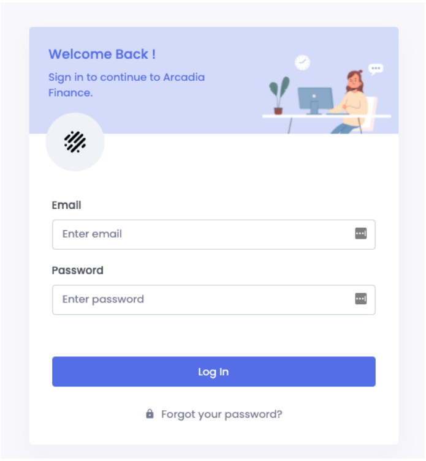

**Step 7**

Login using the following details

**username:** satoshi@bitcoin.com <br/>
**password:** bitcoin

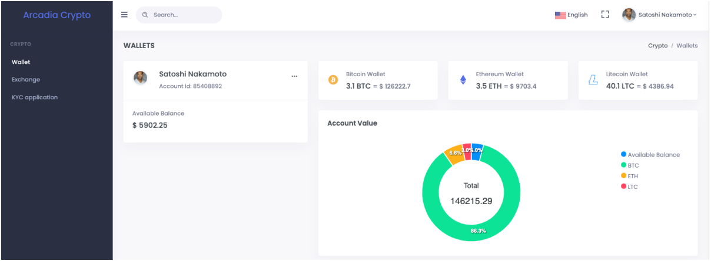

At the moment we still have two key features missing:
* We are serving only http, not https. We want our site to be fully secured therefore all
communications need to be encrypted
* We are not actively monitoring the health of the pods through the data path


### Part 2 - Enabling the NGINX+ dashboard

Open a new terminal window or tab

**Step 1**
Get the name of your NGINX IC Pod

`kubectl get pods -n nginx-ingress`

```
orasilabs@ip-172-31-8-165:~$ kubectl get pods -n nginx-ingress
NAME                             READY   STATUS    RESTARTS        AGE
nginx-ingress-5f447dbdb5-rdpw6   1/1     Running   4 (4h37m ago)   24h
```

**Step 2**

Let's take a look at how the NGINX Configuration is setup by default in our Ingress Controller pod.

Run <br/>
`kubectl exec -it nginx-ingress-5f447dbdb5-rdpw6 bash -n nginx-ingress`

Remember to replace the Pod name in this example with the name you got from Step 1. This command opens a bash terminal in the Pod for us to execute bash commands.

```
orasilabs@ip-172-31-8-165:~$ kubectl exec -it nginx-ingress-5f447dbdb5-rdpw6 bash -n nginx-ingress
kubectl exec [POD] [COMMAND] is DEPRECATED and will be removed in a future version. Use kubectl exec [POD] -- [COMMAND] instead.
nginx@nginx-ingress-5f447dbdb5-rdpw6:/$
```

**Step 3**

From inside your IC Pod, run: <br/>
`cat /etc/nginx/nginx.conf`

Scroll down until you find this section of the config file:

```
# NGINX Plus APIs
server {
    listen 8080;
    listen [::]:8080;

    root /usr/share/nginx/html;

    access_log off;


    location  = /dashboard.html {
    }

    allow 127.0.0.1;
    allow ::1;

    deny all;
    location /api {
        api write=off;
    }
}
```

This server exposes the dashboard page over port 8080. What we need to do now is to allow requests for the dashboard page to be routed to port 8080 on the IC Pod

**Step 4**

The easiest way to enable access to the dashboard is by port forwarding connections to port 8080 on your local machine to port 8080 on the Ingress Controller pod

Exit out of the IC Pod terminal

`exit`

```
nginx@nginx-ingress-5f447dbdb5-rdpw6:/$ exit
exit
orasilabs@ip-172-31-8-165:~$
```

Run <br/>
`kubectl port-forward nginx-ingress-5f447dbdb5-rdpw6 8080:8080 -n nginx-ingress`

```
orasilabs@ip-172-31-8-165:~$ kubectl port-forward nginx-ingress-5f447dbdb5-rdpw6 8080:8080 -n nginx-ingress
Forwarding from 127.0.0.1:8080 -> 8080
Forwarding from [::1]:8080 -> 8080

```


**Step 5**
Open your browser and go to `127.0.0.1:8080/dashboard.html`

You should be able to see the NGINX+ Dashboard.

**Step 6**

Go to the **HTTP Upstreams** Tab. You should be able to see the Arcadia backend services.

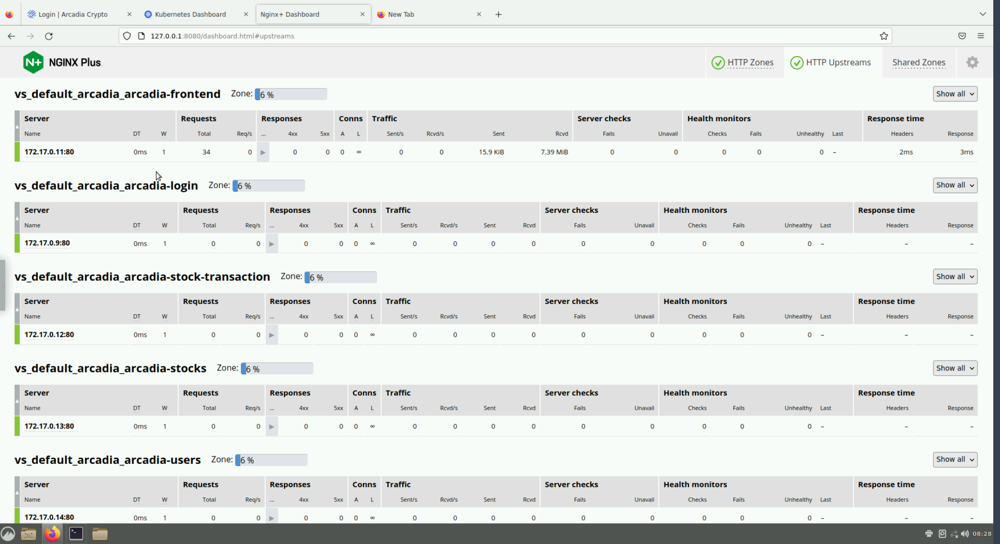


### Part 3 - Scale our Application

At the end of the previous exercise, we saw our Arcadia upstream services on the NGINX+ Dashboard page. Notice how, each service only has 1 upstream server. This is because we have configured our Kubernetes deployment to only run 1 Pod.

**Step 1**

Open the `arcadia_deploy.yaml` file

`sudo vim ~/ingress-apps/arcadia_deploy.yaml`

**Step 2**

Look for each Deployment resource definition and look for the `replicas` field specifically.

```
apiVersion: apps/v1
kind: Deployment
metadata:
  name: arcadia-users
spec:
  replicas: 1
  selector:
    matchLabels:
      app: arcadia-users
      ...
```

Notice the value of 1 for `replicas`. This tells Kubernetes that we want to run 1 Pod for the Deployment of the App specified. In the example above it is the `arcadia-users` app.

**Step 3**

Change the value of `replicas` from **1** to **2** for all **Deployments** in the `arcadia_deploy.yaml` file.


**Step 4**

`cd ~/ingress-apps`

`kubectl apply -f arcadia_deploy.yaml`


**Step 5**

Check the NGINX Dashboard. You should now see two upstreams servers on each of the Arcadia app services.


### Part 4 - Apply HTTPS and Health Checks
<br/>

**Step 1**

Create a Secret. Look at the contents of the `arcadia-secret.yaml` file in the `ingress-apps` folder

`sudo cat ~/ingress-apps/arcadia-secret.yaml`

**Step 2**

`cd ~/ingress-apps`

`kubectl apply -f arcadia-secret.yaml`

**Step 3**

We now apply the TLS secret to our Arcadia VirtualServer specification. We will also add a health check.

Let's create a new version of the `arcadia_virtualserver.yaml` file.

`vim arcadia_virtualserver_v2.yaml`

Add the following lines:

```
apiVersion: k8s.nginx.org/v1
kind: VirtualServer
metadata:
  name: arcadia
spec:
  host: app.arcadia.com
  tls:
    secret: arcadia-wildcard
    redirect:
      enable: true
  upstreams:
    - name: arcadia-users
      service: arcadia-users
      port: 80
      healthCheck:
        enable: true
        path: /healthz
    - name: arcadia-login
      service: arcadia-login
      port: 80
    - name: arcadia-stocks
      service: arcadia-stocks
      port: 80
    - name: arcadia-stock-transaction
      service: arcadia-stock-transaction
      port: 80
    - name: arcadia-frontend
      service: arcadia-frontend
      port: 80
  routes:
    - path: /v1/user
      action:
        pass: arcadia-users
    - path: /v1/login
      action:
        pass: arcadia-login
    - path: /v1/stock
      action:
        pass: arcadia-stocks
    - path: /v1/stockt
      action:
        pass: arcadia-stock-transaction
    - path: /
      action:
        pass: arcadia-frontend

```

With this specification, we have added a simple health check to the **Arcadia Users** upstream.

**Step 4**

`kubectl apply -f arcadia_virtualserver_v2.yaml`

**Step 5**

Look at your **nginx-ingress** service details and find the port number which maps to port 443 in the pod.

```
orasilabs@ip-172-31-8-165:~/ingress-apps$ kubectl get services -n nginx-ingress
NAME            TYPE       CLUSTER-IP     EXTERNAL-IP   PORT(S)                      AGE
nginx-ingress   NodePort   10.107.64.43   <none>        80:30067/TCP,443:30936/TCP   27h
```

In this example, you can that port 443 in the IC pod is exposed to external traffic via port 30936. Save the port number you see in your `nginx-ingress` service

**Step 6**

Open your browser and navigate to `https://app.arcadia.com:<nodeport>`. You should see a browser warning because our certificate is not trusted.


Click the **Advanced...** button and then click **Accept the Risk and Continue**

You should now see the Apps login page.


**Step 7**

Check the NGINX Dashboard page and go to the **HTTP Upstreams** tab.

Look for the **arcadia-users** upstream. You should be able to see the health check results in the **Health Monitors** section of the metrics.

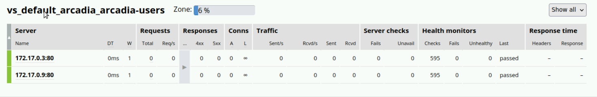

<br/>

## Module 11 - Deploy NGINX App Protect in Kubernetes

The Nginx App Protect will improve the application security posture, especially against OWASP Top
10 attacks.

The Nginx App Protect is deployed in the ingress resource therefor we can see the incoming traffic
towards our application from the outside world.

We’ll be able to bring security closer to the application and the development cycle and integrate it into CI/CD pipelines.

This will allow to minimize false positives, since the web application firewall policy becomes a part of the application and is always tested as such.

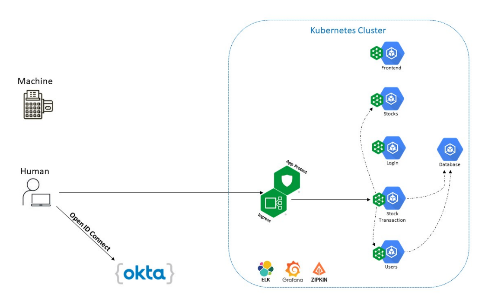


### Part 1 - Deploy Syslog

Before we setup App Protect, we will deploy a syslog server in our cluster so we can capture the App Protect log messages here.

**Step 1**

`cd ~/ingress-apps`

Have a look at the contents of the `syslog.yaml` file.

`cat syslog.yaml`

Note that the Service we define, runs on port 514. This will be important later on.

```
apiVersion: v1
kind: Service
metadata:
  name: syslog-svc
spec:
  ports:
    - port: 514
      targetPort: 514
      protocol: TCP
  selector:
    app: syslog

```


**Step 2**

`kubectl apply -f syslog.yaml`


### Part 2 - Deploy App Protect

**Step 1**

Prepare the NGINX App Protect config

`sudo vim ~/ingress-apps/app_protect.yaml`

```
# APPolicy is the policy configuration. Here we are enabling signature check of known attacks
apiVersion: appprotect.f5.com/v1beta1
kind: APPolicy
metadata:
  name: attacksigs
spec:
  policy:
    name: attacksigs
    template:
      name: POLICY_TEMPLATE_NGINX_BASE
    applicationLanguage: utf-8
    enforcementMode: blocking
    signature-sets:
    - name: All Signatures
      block: true
      alarm: true

---

apiVersion: appprotect.f5.com/v1beta1
kind: APLogConf
metadata:
  name: logconf
spec:
  content:
    format: default
    max_message_size: 64k
    max_request_size: any
  filter:
    request_type: all

---
apiVersion: k8s.nginx.org/v1
kind: Policy
metadata:
  name: waf-policy
spec:
  waf:
    enable: true
    apPolicy: "default/attacksigs"
    securityLog:
      enable: true
      apLogConf: "default/logconf"
      logDest: "syslog:server=syslog-svc.default:514"

```

**Step 2**

`kubectl apply -f app_protect.yaml`


**Step 3**

Enable NGINX App Protect on the Arcadia VirtualServer

`vim ~/ingress-apps/arcadia_virtualserver_v2.yaml`

Add the `waf-policy` as shown below

```
apiVersion: k8s.nginx.org/v1
kind: VirtualServer
metadata:
  name: arcadia
spec:
  host: app.arcadia.com
  tls:
    secret: arcadia-wildcard
    redirect:
      enable: true
  policies:
    - name: waf-policy
  upstreams:
    - name: arcadia-users
      service: arcadia-users
      port: 80
      healthCheck:
        enable: true
        path: /healthz
    ...

```


**Step 4**

`kubectl apply -f arcadia_virtualserver_v2.yaml`

**Step 5**

Browse again to the Arcadia web app and verify that it is still working.

**Step 6**

Let’s simulate a Cross Site Scripting (XSS) attack, and make sure it’s blocked:

On your browser hit the following URL:

`https://app.arcadia.com:<nodeport>/?a=%3Cscript%3Ealert(%27xss%27)%3C/script%3E`

You should notice that the request is blocked.

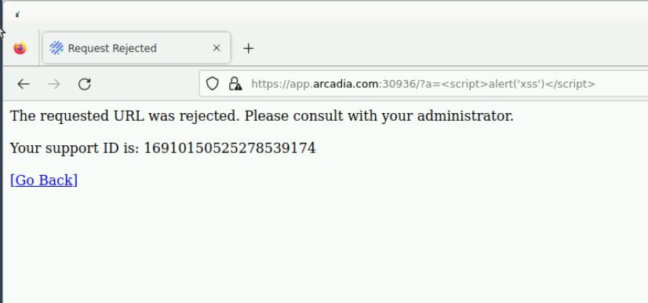

**Step 7**

Let's try and view the App Protect Security log by accessing our **syslog** service

First we need the name of our **syslog** pod

```
orasilabs@ip-172-31-15-199:~/ingress-apps$ kubectl get pods
NAME                                         READY   STATUS    RESTARTS         AGE
application1-86c6c44bdf-dscs5                1/1     Running   10 (3h26m ago)   3d20h
application1-86c6c44bdf-jsd4j                1/1     Running   10 (3h26m ago)   3d20h
application2-86584dd9cb-mjr9f                1/1     Running   10 (3h26m ago)   3d20h
arcadia-db-59c9b67bb-9djlt                   1/1     Running   9 (16h ago)      2d18h
arcadia-db-59c9b67bb-ks8vl                   1/1     Running   9 (16h ago)      2d22h
arcadia-frontend-757fb77bc5-5wvkm            1/1     Running   8 (16h ago)      2d22h
arcadia-frontend-757fb77bc5-q2f67            1/1     Running   8 (16h ago)      2d18h
arcadia-login-755fd687d4-ffx4c               1/1     Running   8 (3h26m ago)    2d18h
arcadia-login-755fd687d4-x5bjx               1/1     Running   8 (3h26m ago)    2d22h
arcadia-stock-transaction-56485ff8fb-2wvrv   1/1     Running   19 (3h24m ago)   2d22h
arcadia-stock-transaction-56485ff8fb-6pzct   1/1     Running   20 (3h24m ago)   2d18h
arcadia-stocks-7d449cc4f8-59nlr              1/1     Running   8 (3h26m ago)    2d22h
arcadia-stocks-7d449cc4f8-gkp5c              1/1     Running   8 (3h26m ago)    2d18h
arcadia-users-79b45d865c-4l2dm               1/1     Running   20 (3h24m ago)   2d18h
arcadia-users-79b45d865c-ksz7s               1/1     Running   19 (3h24m ago)   2d22h
syslog-7d76777b85-48lwn                      1/1     Running   5 (16h ago)      2d3h
```

In this example the name is `syslog-7d76777b85-48lwn`.

Copy the name of the syslog pod in your cluster.

**Step 8**

Run the following command:

`kubectl exec -it <syslog pod> -- tail -f /var/log/messages`

You should see a security log message indicating a XSS attack, similar to the below message.

```
Nov 20 03:23:07 nginx-ingress-5f465d7f76-sfrzz ASM:attack_type="Abuse of Functionality,Cross Site Scripting (XSS),Other Application Activity",blocking_exception_reason="N/A",date_time="2022-11-20 03:23:06",dest_port="443",ip_client="172.17.0.1",is_truncated="false",method="GET",policy_name="attacksigs",protocol="HTTPS",request_status="blocked",response_code="0",severity="Critical",sig_cves=",,,",sig_ids="200001475,200000098,200001088,200101609",sig_names="XSS script tag end
...

```


### Part 3 - Bot Protection

The application APIs at the moment are published only for consumption by browsers.
Therefore we don’t want to allow any kind of automated tool to access these endpoints.
We are going to block not only malicious bots but also tools like `curl`.


**Step 1**

Try and access the **stock microservice** and get data with `curl`

`curl -k https://app.arcadia.com:<nodeport>/v1/stock/ticker/all`

You will notice the request succeeds and we are able to get stock information.

```
orasilabs@ip-172-31-15-199:~/ingress-apps$ curl -k https://app.arcadia.com:30936/v1/stock/ticker/all
{"btc":{"ticker":{"symbol":"tBTCUSD","bid":16675,"bidSize":50.75982,"ask":16676,"askSize":38.7341531,"dailyChange":49,"dailyChangePerc":0.0029,"lastPrice":16676,"volume":526.04912954,"high":16811,"low":16538}},"eth":{"ticker":{"symbol":"tETHUSD","bid":1218.3,"bidSize":637.69085894,"ask":1218.4,"askSize":626.84599297,"dailyChange":9.7,"dailyChangePerc":0.008,"lastPrice":1218.4,"volume":6870.96141418,"high":1232.3,"low":1197.3}},"ltc":{"ticker":{"symbol":"tLTCUSD","bid":63.48,"bidSize":1931.29430013,"ask":63.53,"askSize":1464.76123632,"dailyChange":1.251,"dailyChangePerc":0.0201,"lastPrice":63.511,"volume":14293.29099662,"high":64.812,"low":61.621}}}
```


**Step 2**

Let's modify our `attacksigs` APPolicy Resource to include `bot-defense`

We will create a new yaml file for this.

`vim ~/ingress-apps/app_protect_bot.yaml`

```
apiVersion: appprotect.f5.com/v1beta1
kind: APPolicy
metadata:
  name: attacksigs
spec:
  policy:
    name: attacksigs
    template:
      name: POLICY_TEMPLATE_NGINX_BASE
    applicationLanguage: utf-8
    enforcementMode: blocking
    signature-sets:
    - name: All Signatures
      block: true
      alarm: true
    # The bellow config is in charge of defining what bot to block and whom to allow
    bot-defense:
      settings:
        isEnabled: true
      mitigations:
        classes:
        - name: trusted-bot
          action: alarm
        - name: untrusted-bot
          action: block
        - name: malicious-bot
          action: block

```


**Step 3**

```
orasilabs@ip-172-31-15-199:~/ingress-apps$ kubectl apply -f app_protect_bot.yaml
appolicy.appprotect.f5.com/attacksigs configured
```

**Step 4**

Run `curl -k https://app.arcadia.com:<nodeport>/v1/stock/ticker/all` again.

This time the request should be blocked

```
orasilabs@ip-172-31-15-199:~/ingress-apps$ curl -k https://app.arcadia.com:30936/v1/stock/ticker/all
<html><head><title>Request Rejected</title></head><body>The requested URL was rejected. Please consult with your administrator.<br><br>Your support ID is: 196868960713134620<br><br><a href='javascript:history.back();'>[Go Back]</a></body></html>
```
**Step 5**

Browser the log messages from the syslog pod.

`kubectl exec -it <syslog pod> -- tail -f /var/log/messages`

You should see a message like the following:

```
Nov 20 04:06:28 nginx-ingress-5f465d7f76-sfrzz ASM:attack_type="Non-browser Client",blocking_exception_reason="N/A",date_time="2022-11-20 04:06:28",dest_port="443",ip_client="172.17.0.1",is_truncated="false",method="GET",policy_name="attacksigs",protocol="HTTPS",request_status="blocked",response_code="0",severity="Critical",sig_cves="N/A",sig_ids="N/A",sig_names="N/A",sig_set_names="N/A",src_port="43643",sub_violations="N/A",support_id="196868960713134620"
```
